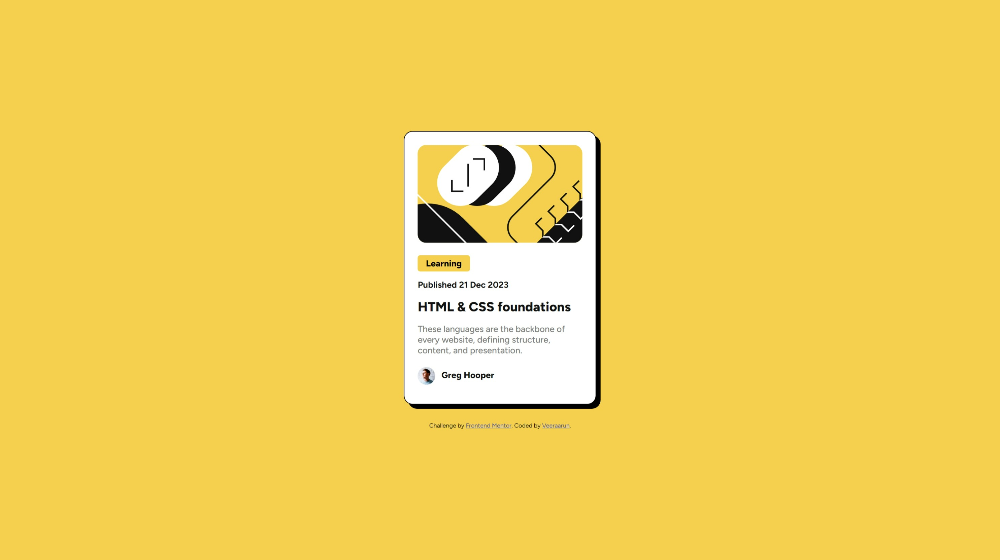

# Frontend Mentor - Blog preview card solution

This is a solution to the [Blog preview card challenge on Frontend Mentor](https://www.frontendmentor.io/challenges/blog-preview-card-ckPaj01IcS). 
## Table of contents

- [Overview](#overview)

  - [Screenshot](#screenshot)
  - [Links](#links)
  - [Built with](#built-with)

## Overview

### Screenshot

### Links

- Solution URL: [https://www.frontendmentor.io/solutions/blog-preview-card-solution-NHfRcv_8f3]
- Live Site URL: [https://veeraarun.github.io/Frontend-Mentor__Blog-preview-card-solution/]

### Built with

- Semantic HTML5 markup
- CSS custom properties
- Flexbox
- CSS Grid
- Root pseduo 
